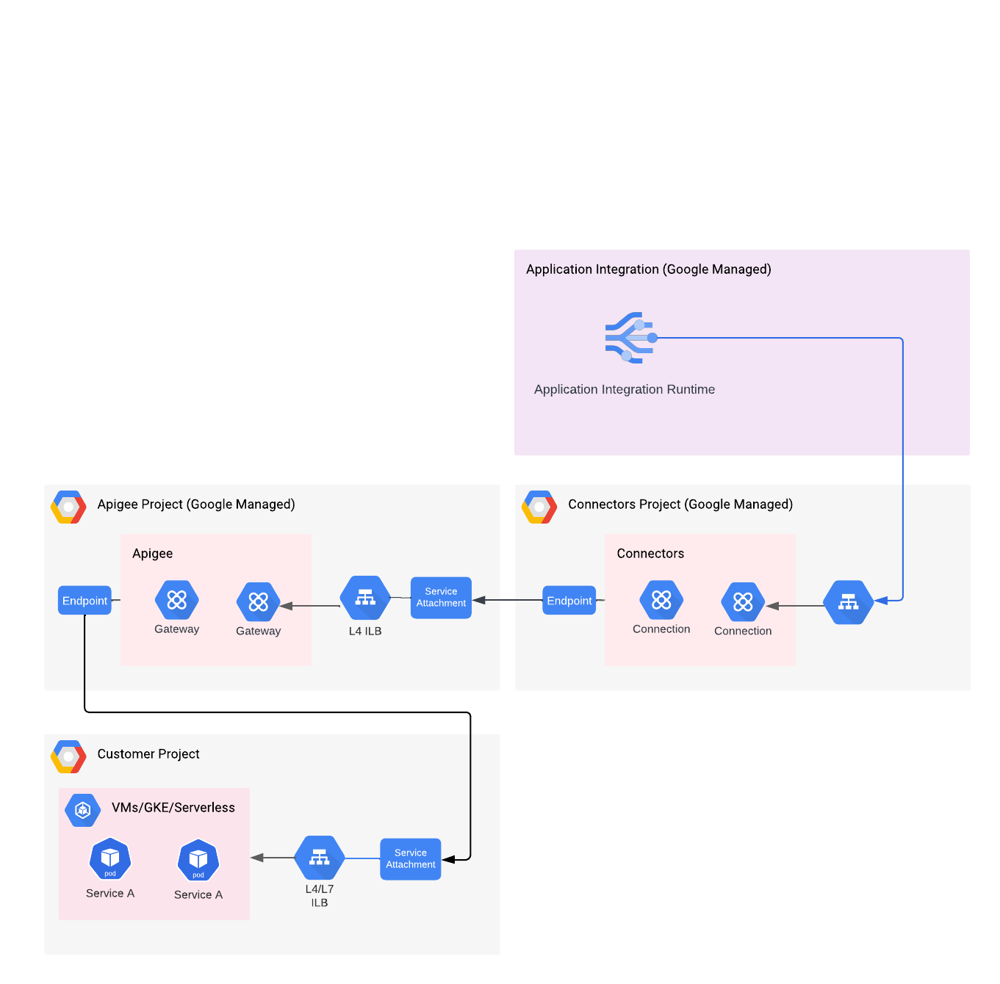

# Invoke Apigee APIs from Application Integration

This sample repository demonstrates how to invoke [Apigee](https://cloud.google.com/apigee/docs/overview) runtime APIs through a private network from [Application Integration](https://cloud.google.com/application-integration/docs/overview).

# Description

The concept of [Private Service Connect](https://cloud.google.com/vpc/docs/private-service-connect) or PSC is leveraged in this pattern. If you are new to PSC, please consider reading the documentation for PSC before attempting this solution.

Apigee exposes the runtime APIs (sometimes referred to as northbound) through a PSC Service Attachment. This [article](https://cloud.google.com/apigee/docs/api-platform/system-administration/northbound-networking-psc) describes how Apigee is exposed via PSC. The [HTTP Connector](https://cloud.google.com/integration-connectors/docs/connectors/http/configure) of Integration Connectors can accept a service attachment as a destination. This allows Integration Connectors to privately invoke APIs exposed by Apigee. The following diagram shows the network components involved:



<p style="text-align: center;"><i>This image shows workloads in GCP. However, the target could be on the internet, on-prem etc.</i></p>
<br><br>

1. Use the [Instances API](https://cloud.google.com/apigee/docs/reference/apis/apigee/rest/v1/organizations.instances/get) to query the service attachment name. You can also use [apigeecli](https://github.com/apigee/apigeecli) like this:

```sh
apigeecli instances get -n $name -o $org -t $token
```

The resulting JSON will contain:

```json
"serviceAttachment": "projects/pxxxxxxxxxxx-tp/regions/<region>/serviceAttachments/<name>"
```

This service attachment will be used to create a HTTP connection (step 4).

2. Use the [Connectors API](https://cloud.google.com/integration-connectors/docs/reference/rest/v1/projects.locations.connections/list) to query any/all existing connections. You can also use [integrationcli](https://github.com/srinandan/integrationcli) like this:

```sh
integrationcli connectors list -p $project -t $token
```

The resulting JSON will contain (from any of the connections):

```json
"serviceDirectory": "projects/<connector-project-name>/locations/<region>/namespaces/connectors/services/runtime"
```

The project name is important for the next step.

3. Allow connectors access to call Apigee APIs through PSC. Patch the Apigee instance to add the connector project. This can be done through the [Instaces API](https://cloud.google.com/apigee/docs/reference/apis/apigee/rest/v1/organizations.instances/patch). You can also use [apigeecli](https://github.com/apigee/apigeecli) like this:

```sh
apigeecli instances update -n $name -o $org -c <connector-project-name> -t $token
```

The response should look like this:

```
	"consumerAcceptList": [
		"<connector-project-name>",
		"<project-attached-to-apigee>"
	]
```

4. The included [HTTP Connection](./connectors/apigee.json) describes the JSON for creating the connection. Use the information from Step 1 (the Apigee instance service attachment name) and update the [HTTP Connection](./connectors/apigee.json). The connector will be created through Cloud Build

# Prerequisites

* Apigee is provisioned and at least one Apigee instance exists
* There exists at least one Connector already provisioned
* The integration version JSON is downloaded [here](./src/executeworkflows.json)
* This repo uses a custom cloud builder called `integrationcli-builder`, based on [integrationcli](https://github.com/srinandan/integrationcli) and gcloud

# Configuring Cloud Build

In the setting page of Cloud Build enable the following service account permissions:
* Secret Manager (Secret Manager Accessor)
* Service Accounts (Service Account User)
* Cloud Build (Cloud Build WorkerPool User)

Grant the Application Integration Admin role to the Cloud Build Service Agent

```
    gcloud projects add-iam-policy-binding PROJECT_ID \
        --member="serviceAccount:service-PROJECT_NUMBER@gcp-sa-cloudbuild.iam.gserviceaccount.com" \
        --role="roles/integrations.integrationAdmin"
```

## Steps

1. Modify the [connectors file](./connectors/apigee.json) to set the appropriate Service Account and Service Attachment. Replace the following strings

```
"serviceAccount": "<sa-name>@<project-id>.iam.gserviceaccount.com",
...
            "destinations": [
                {
                    "serviceAttachment": "projects/<apigee-tenant-project>/regions/<location>/serviceAttachments/<apigee-sa-name>"
                }
...
```

2. Trigger the build manually

```sh

gcloud builds submit --config=cloudbuild.yaml --region=<region-name> --project=<project-name>
```

The integration is labeled with the `SHORT_SHA`, the first seven characters of the commit id
___

## Support

This is not an officially supported Google product
